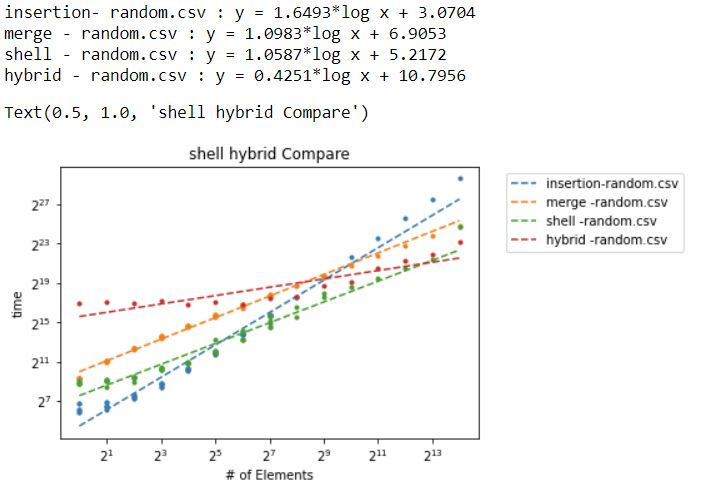

# Algorithm_Analysis
## Sort_Algorithm_Analysis
### Insertion Sort

#### Uses two for loops: one that iterates through the group sizes needs to be checked, one that iterates through the group being sorted. For the sake of experiment, I used the sort by gap and set the gap to 1. This is to ensure that the sorting algorithms don’t have different comparisons. The insertion sort swaps every valid check.

### Merge Sort
#### Uses a merge function and a merge helper recursively. The initial merge function will call two merge helpers: one for the first half, one for the second half. The helper function will recursively split the vectors and store them into new vectors, until the vector is size 2. The merge function combines the vectors together. The merge function creates a new vector every split.

### Shell Sort
#### Uses differing gaps to pre-organize the array, before doing a final insertion sort. The sorting is done using a sort_by_gap function that sorts by gap. It's an insertion sort with some conditions to ensure it is bounded. The sequences are listed above, and are hard coded into the functions. The starting position of the gap is pre-calculated and does not affect timing. The gap insertion sort swaps every valid check.

### Hybrid Sort
#### Uses a H factor to determine when merge sort is inefficient and when insertion sort should be used to help finish the sorting. It sorts using merge till H is reached then, insertion sort to finish the sort. This uses the functions above to help create the sorting algorithm. Any flaws above also affects the hybrid sort.

### Results

## Bin_Packing_Algorithm_Analysis

### Best Fit
#### Best fit searches through previous bins and the minimal-waste bin that fits will be the bin that stores the next element. Best fit uses a zip tree that carries a key, value and rank. The key and rank is used to organize the tree. The key represents the remaining capacity. This requires the key to be unique, the key is augmented to be a struct containing a unique key and the remaining capacity. The remaining capacity is compared first then it uses the key to compute the order for equal remaining capacity. The value represents the bin number. Using a local biggest remaining capacity(BRC), we can search a tree without traversing too deep. 

### First Fit
#### First fit searches through previous bins and the first bin that fits will be the bin that stores the next element. First fit uses a zip tree that carries a key, value and rank. The key and rank is used to organize the search tree. The key  represents the bin number. The value represents the remaining storage of a bin. Using a local biggest remaining capacity(BRC), we can search a tree without traversing too deep. 

### Next Fit
#### Next fit checks the next largest bin number and then if the storage fits then it will put it in. If the bin does not fit then a new bin will be created to fit the storage. No previous bin will be looked at. This was implemented with an index as the current bin holder. This uses a for loop to iterate through the elements and check the index for fitting.

### Results

## Network_Algorithm_Analysis

### Network Representation
#### Graph uses an edge map and vector map. Each node is identified via the vector map. The nodes store the identification value. Node comparsion is done using the identifying number. The number of Nodes need to be predefined and no implementation of adding or deleting nodes was added. The graph is created by taking 2 vectors u and v, of equal size, where u is connected to v.

### Network Creation
#### Generated using a Erdos-Renyi random graph algorithm. By picking a random number between 0 and 1 it will pick the probability of which a node will be added. The probability is calculated using the equation Log(1-r)/log(1-p).

### Network Analysis
#### Implemented function to find the diameter, cluster coefficent, and degree.

### Results

